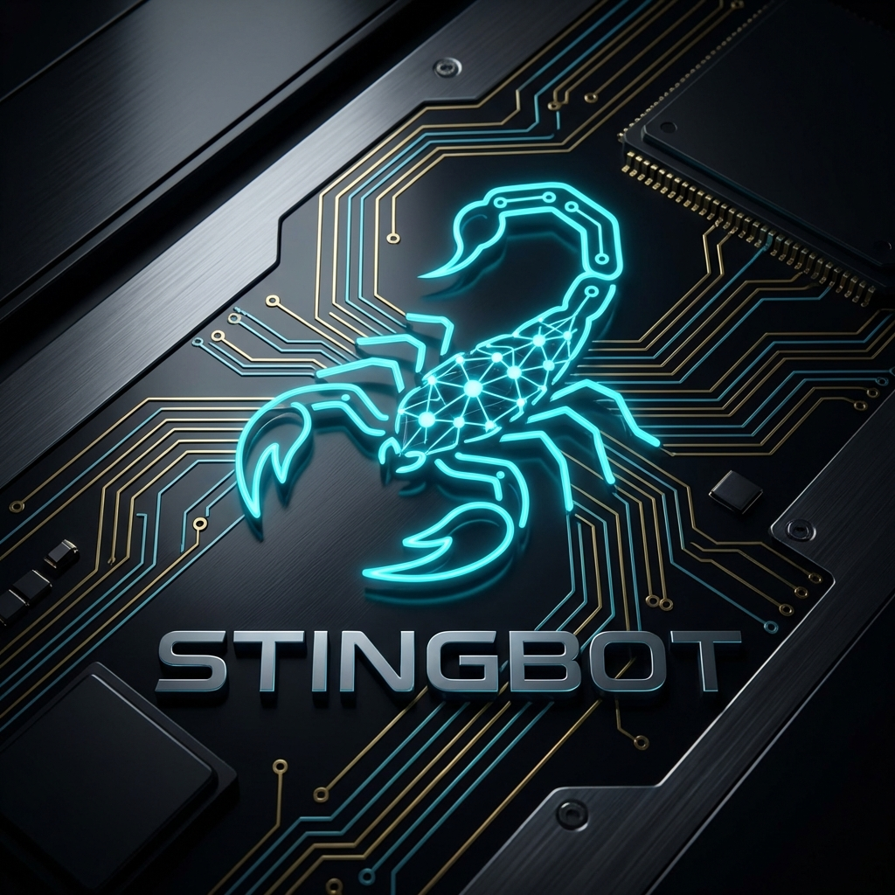

# 🦂 Stingbot — Neural Security Engine

<p align="center">
    
</p>

<p align="center">
  <strong>NEURIZE! EXPLOIT! SECURE!</strong>
</p>

<p align="center">
  <a href="https://github.com/subhadeep-sec/STINGBOT/actions"></a>
  <a href="https://github.com/subhadeep-sec/STINGBOT/releases"></a>
  <a href="LICENSE"></a>
</p>

# STING: Autonomous Multi-Agent Platform 🦂

**STING** (formerly Stingbot) is a premium, AI-powered Multi-Agent System (MAS) designed for autonomous offensive security missions. Built for zero-cost local execution, it leverages a Supervisor-Agent architecture to decompose complex goals into actionable intelligence.

## 🚀 One-Line Installation

Deploy the **STING Neural Engine** to your environment with a single command:

```bash
curl -sSL https://raw.githubusercontent.com/subhadeep-sec/STINGBOT/main/install.sh | bash
```

> [!IMPORTANT]
> This command will synchronize neural assets, configure your local LLM environment, and establish a global mission control link. Requires **Kali Linux**, **macOS**, or **WSL2**.
Preferred setup: run the onboarding wizard (`npx stingbot-ai onboard`). It walks through the neural brain setup, security tool parity, and pairing. The CLI wizard is the recommended path and works on **Kali Linux, macOS, and Windows (via WSL2; strongly recommended)**.

### 🧠 Models (Neural Brain)

Stingbot is designed for high-performance local inference.
- **Ollama (Recommended)**: Run `llama3.2` or `mistral` locally for maximum privacy.
- **Failover**: Supports fallback to cloud models if local resources are constrained.

## 📦 Installation (One-Line)

Stingbot is designed for instant deployment. Copy and paste:

```bash
curl -fsSL https://raw.githubusercontent.com/subhadeep-sec/STINGBOT/main/install.sh | bash
```

## 🎮 The Master Guide: How to use Stingbot

Once installed, Stingbot operates as a decoupled neural platform. Follow these steps to launch your first mission.

### 1. Initialize the Gateway
The Gateway is the "Control Plane". It manages connections between the Web UI and the Python Brain.
```bash
# Run the gateway locally
node gateway/bin/onboard.js gateway
```
*Look for: `🦂 STINGBOT GATEWAY ACTIVE` on port 18789.*

### 2. Run a Neural Health Check
Always ensure your system parity is correct before a mission.
```bash
node gateway/bin/onboard.js doctor
```

### 3. Operate the Python Brain (Legacy/CLI)
For direct interaction with the offensive engine without the web interface:
```bash
cd agents/python-brain
python3 main.py
```

### 4. Interactive Onboarding
If you ever need to re-configure your link:
```bash
# Locally
node gateway/bin/onboard.js onboard

# Or via NPX (if published)
npx stingbot-ai onboard
```

## 🏗️ Architecture (Clawbot Fidelity)

```
Web Dashboard (React) <─── Socket.io ───> Neural Gateway (Node.js)
                                            │
                                            ▼
                                     Python Brain (RPC)
                                            │
                                  ┌─────────┴─────────┐
                                  ▼                   ▼
                           Security Tools       Local LLM (Ollama)
```

## 🛠️ Components
- **`gateway/`**: The Node.js WebSocket control plane.
- **`client/`**: The React/Vite premium web interface (Under development).
- **`agents/python-brain/`**: The core offensive security engine (Python).

## 🔒 Security defaults
Stingbot is a professional tool. Run `node gateway/bin/onboard.js doctor` to surface any insecure configurations.

---
Built with intensity. **Stay Lethal.** 🦂
