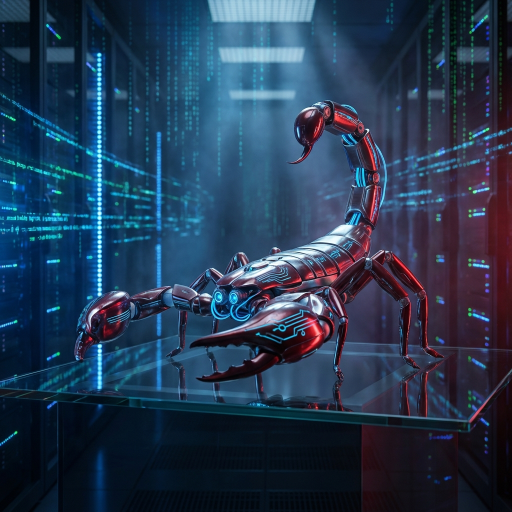
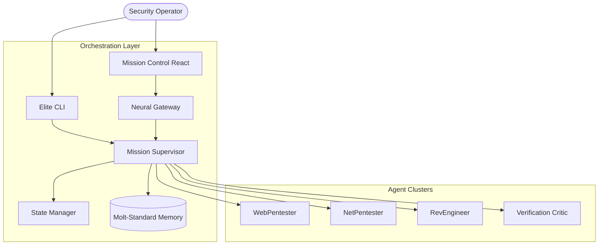

# 🦂 STINGBOT: Molt-Standard Neural Security Engine



<p align="center">
  
  
  
  
</p>

---

## 🌟 Overview

**STINGBOT** is a flagship, AI-driven Multi-Agent System (MAS) built to the prestigious **Moltbot Standard** of autonomous offensive security. It represents the pinnacle of autonomous orchestration, utilizing a refined Supervisor-Agent framework to execute high-fidelity security operations.

Designed for precision and lethal efficiency, STINGBOT enables elite security practitioners to deploy autonomous clusters for complex missions, providing deep insights through neural reasoning and sophisticated memory systems.

---

## ✨ Key Capabilities

| Feature | Description |
| :--- | :--- |
| **Molt-Standard Intelligence** | Advanced turn-based reasoning and goal decomposition. |
| **Elite Multi-Agent Core** | Coordinated specialists: WebPentester, NetPentester, RevEngineer. |
| **Neural Memory** | Full state persistence with ChromaDB-powered associative recall. |
| **Sovereign Safety** | Deterministic command blacklisting and target validation layers. |
| **Unified Command** | High-performance CLI paired with a premium React Mission Control. |
| **Model Agnostic** | Seamless support for Ollama, OpenAI, Anthropic, and Gemini. |

---

## 🚀 Quick Start

### Prerequisites

- **Python**: 3.10+
- **Node.js**: 18.x+
- **Platform**: Linux (Kali), macOS, or WSL2

### Deployment

Initialize the engine:

```bash
git clone https://github.com/subhadeep-sec/STINGBOT.git && cd STINGBOT
./install.sh
```

### Direct Mission

```bash
stingbot "Analyze demo-app.local for security vulnerabilities"
```

---

## 🏗️ System Architecture

STINGBOT operates on a distributed neural framework, ensuring high-durability orchestration.



---

## 🛡️ Safety & Responsible Use

Built with professional standards, STINGBOT enforces strict Rules of Engagement:

> [!IMPORTANT]
> **Command Filtering**: Autonomous actions are audited against a deterministic safety blacklist.
> **Target Validation**: Execution is restricted to authorized environments and IP ranges.
> **Operator Override**: Full manual control is available via the CLI and Dashboard.

---

## 📜 License

Distributed under the **MIT License**.

## ⚠️ Disclaimer

STINGBOT is for **authorized testing and educational use only**. The developers assume no liability for unauthorized usage.

---

<p align="center">
  <strong>Molt-Standard Flagship. STAY LETHAL.</strong> 🦂
</p>
