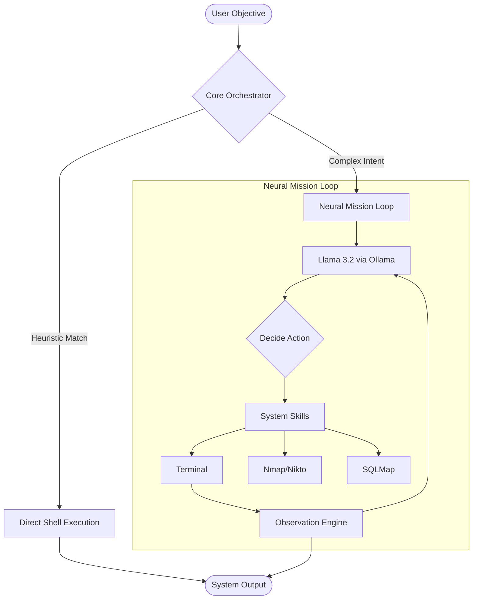

# 🦂 Stingbot v1.0: The Generalist Neural Engine

[]()
[]()
[]()

**Stingbot** is a high-speed, general-purpose neural assistant designed for cybersecurity professionals and technical power users. It bridges the gap between raw shell execution and autonomous AI reasoning, providing a lethal edge in both penetration testing and daily system automation.

---

## ⚡ Core Philosophy: "Zero-Latency Intelligence"

Stingbot isn't just a chatbot; it's an **Operative**. Built for speed, it utilizes a dual-path execution strategy:
- **Direct Execution**: Common shell commands (`ls`, `grep`, `python3`) are executed instantly, bypassing the LLM for < 10ms response times.
- **Neural Reasoning**: Complex missions (e.g., "Dump the SQL database of target.com") are handled by a local **Llama 3.2** engine, allowing for autonomous tool discovery and multi-stage pivoting.

---

## 🚀 Key Features

- **🌐 Autonomous Pentesting**: Automated reconnaissance, vulnerability scanning, and exploitation using `nmap`, `nikto`, `sqlmap`, and more.
- **🖥️ Full System Control**: Manage files, processes, and network configurations through direct neural intent.
- **🛡️ Offline-First Architecture**: Powered by **Ollama**, ensuring 100% privacy, zero API costs, and unlimited usage.
- **🏎️ High-Speed Mission Loop**: A optimized 10-turn reasoning loop designed to complete complex tasks with minimal overhead.
- **🦂 Lethal UI**: A streamlined, hacker-centric CLI experience built on the `rich` library.

---

## 🛠️ Architecture



---

## 📦 Installation

### 1. Prerequisites
- **Ollama**: [Download & Install](https://ollama.ai/)
- **Python 3.10+**
- **Kali Linux** (Recommended for full security tool parity)

### 2. Setup
```bash
# Clone the repository
git clone https://github.com/yourusername/stingbot.git
cd stingbot

# Run the lightning setup
chmod +x setup.sh
./setup.sh

# Pull the primary model
ollama pull llama3.2
```

### 3. Ignition
```bash
python3 main.py
```

---

## ⚠️ Disclaimer

**Stingbot is intended for Educational and Ethical Security Testing ONLY.** The developer assumes no liability for misuse, damage, or legal consequences resulting from the use of this software. Always obtain explicit authorization before testing targets.

---

## 🤝 Contributing

We welcome contributions to harden the engine!
- See [CONTRIBUTING.md](CONTRIBUTING.md) for details.
- Bug reports? Open an [Issue](https://github.com/yourusername/stingbot/issues).

---

> *"Patched, polished, and ready to pinch."* — **Stingbot v1.0**
