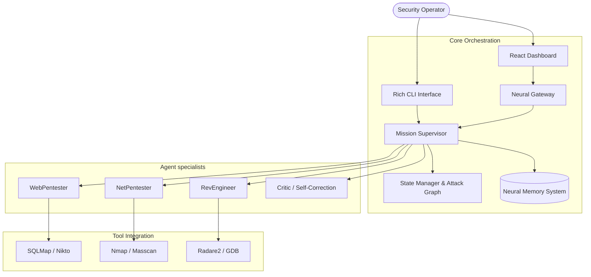

# 🦂 STINGBOT: Advanced Neural Security Engine


<p align="center">
  
  
  
  
</p>

---

## 🌟 Overview

**STINGBOT** is a state-of-the-art, AI-driven Multi-Agent System (MAS) engineered for autonomous offensive security operations. By harmonizing a sophisticated Supervisor-Agent architecture with advanced neural reasoning, STINGBOT transforms high-level security objectives into precise, actionable intelligence.

Designed for high-fidelity security research, STINGBOT enables security professionals to orchestrate complex missions—from clandestine network reconnaissance to deep binary analysis—with unprecedented autonomy and safety.

---

## ✨ Key Capabilities

| Feature | Description |
| :--- | :--- |
| **Autonomous Logic** | Self-decomposing mission goals and dynamic turn-based reasoning. |
| **Multi-Agent Core** | Orchestrated specialists: WebPentester, NetPentester, RevEngineer, and more. |
| **Neural Memory** | Stateful attack graphs and ChromaDB-powered episodic & semantic memory. |
| **Safety First** | Multi-layer execution guardrails and target verification system. |
| **Unified Command** | High-performance CLI interface paired with a modern React Dashboard. |
| **Model Agnostic** | Seamless integration with Ollama, OpenAI, Anthropic, and Google Gemini. |

---

## 🚀 Quick Start

### Prerequisites

Ensure your environment meets the following requirements:
- **Python**: 3.10+ (Dedicated 3.10 recommended for neural dependencies)
- **Node.js**: 18.x or above
- **Architecture**: Linux (Kali preferred), macOS, or WSL2

### Installation

Deploy the engine in a single command:

```bash
# Clone and Initialize
git clone https://github.com/subhadeep-sec/STINGBOT.git && cd STINGBOT

# Run the Intelligent Installer
./install.sh
```

### Basic Usage

Launch the mission control center:

```bash
# Direct Mission Invocation
stingbot "Analyze demo-app.local for SQL injection vulnerabilities"

# Interactive Terminal Mode
stingbot --interactive
```

---

## 🏗️ System Architecture

STINGBOT operates on a distributed neural architecture, separating high-level reasoning from specialized tool execution.



---

## 🛡️ Safety & Responsible Use

STINGBOT is equipped with a rigorous safety subsystem designed to enforce Rules of Engagement (RoE):

> [!IMPORTANT]
> **Deterministic Filtering**: All commands are processed through a regex-based blacklist to prevent destructive actions (e.g., `rm -rf /`).
> **Target Validation**: Missions are restricted to authorized IP ranges and hostnames defined in the configuration.
> **Human-in-the-Loop**: Critical actions can be configured to require operator manual approval.

---

## 🛠️ Development & Customization

The platform is designed for extensibility. New agents can be integrated into the ecosystem by inheriting from `BaseAgent` and implementing the `execute` life cycle.

```python
from agents.base_agent import BaseAgent

class CustomAgent(BaseAgent):
    def execute(self, task):
        # Neural reasoning + Tool invocation
        pass
```

---

## 📜 License

Distributed under the **MIT License**. See `LICENSE` for more information.

## ⚠️ Disclaimer

STINGBOT is for **authorized security testing and educational purposes only**. Misuse of this software for unauthorized access to systems is illegal and unethical. The developers assume no liability for any damage caused by this tool.

---

<p align="center">
  Generated by the NEUROSEC-AI Core. <strong>STAY LETHAL.</strong> 🦂
</p>
