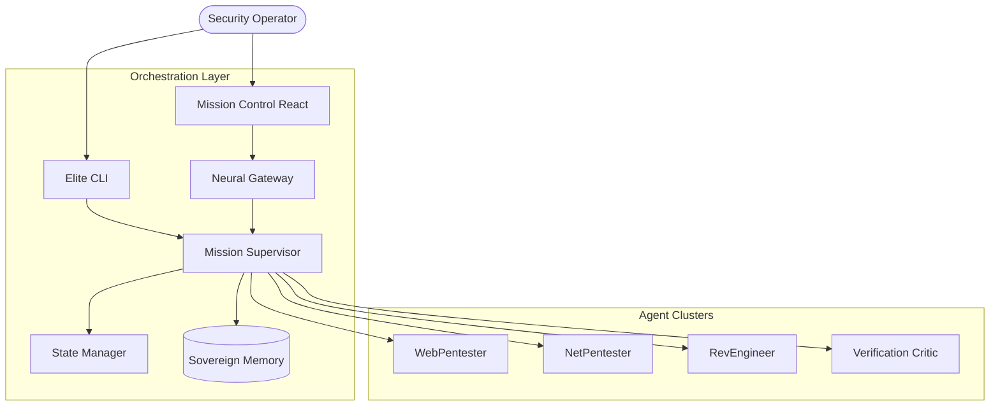

# 🦂 STINGBOT: The Sovereign Neural Security Engine


<p align="center">
  
  
  
  
</p>

---

## 🌟 Sovereign Intelligence. Autonomous Execution.

**STINGBOT** is a high-performance, AI-driven Multi-Agent System (MAS) engineered to the **Moltbot Standard** of autonomous offensive security. Unlike traditional tools, STINGBOT doesn't just scan; it **reasons, learns, and orchestrates** complex security missions with lethal precision.

> [!IMPORTANT]
> **Moltbot Standard**: STINGBOT adheres to the elite standard of autonomous AI, ensuring stateful memory, goal-driven decomposition, and deterministic safety layers.

---

## ✨ Core Pillars

- **🧠 Neural Orchestration**: A central Supervisor decomposes high-level goals into tactical sub-missions.
- **🦂 Multi-Agent Clusters**: Specialized agents for Web, Network, and Reverse Engineering working in parallel.
- **🔄 Stateful Memory**: Persistent episodic and semantic memory ensures the engine learns from every hex and packet.
- **🛡️ Sovereign Guardrails**: Hardened safety protocols that validate every command against operator-defined rules.
- **⚡ Performance First**: Optimized for massive scalability and real-time response.

---

## 🚀 Deployment Link

Initialize the sovereign engine in seconds:

```bash
# Clone the repository
git clone https://github.com/subhadeep-sec/STINGBOT.git && cd STINGBOT

# Zero-touch installation
./install.sh
```

### Direct Mission Command
```bash
# Launch a complex mission directly
stingbot "Analyze the internal network for high-risk vulnerabilities"
```

---

## 🏗️ Neural Architecture

STINGBOT operates on a distributed neural framework, ensuring high-durability orchestration.



---

## 🗺️ Next Generation Roadmap

We are constantly evolving to push the boundaries of autonomous security.
- [ ] **Multi-Model Swarms**: Dynamic model switching between local (Ollama) and Cloud (Gemini/GPT-4).
- [ ] **Visual Graph Missions**: Real-time 3D visualization of the attack graph.
- [ ] **Self-Repairing Exploits**: Autonomous payload refinement based on target feedback.
- [ ] **Hardware Acceleration**: Optimized CUDA/MLX support for local inference.

---

## 🤝 Community & Contribution

STING is built for the community. Whether you're an AI researcher or an offensive security pro, we welcome your expertise.

- 🐞 **Found a bug?** Open an [Issue](https://github.com/subhadeep-sec/STINGBOT/issues).
- ✨ **Have an idea?** Start a [Discussion](https://github.com/subhadeep-sec/STINGBOT/discussions).
- 🛠️ **Want to build?** Check our [Contributing Guide](CONTRIBUTING.md).

---

## 📜 License & Safety

Distributed under the **MIT License**. STINGBOT is designed for **authorized testing and educational use only**. The developers assume no liability for unauthorized usage.

> [!CAUTION]
> Always verify your target environment before launching an autonomous mission.

---

<p align="center">
  <strong>STAY LETHAL. STAY SOVEREIGN.</strong> 🦂
</p>
